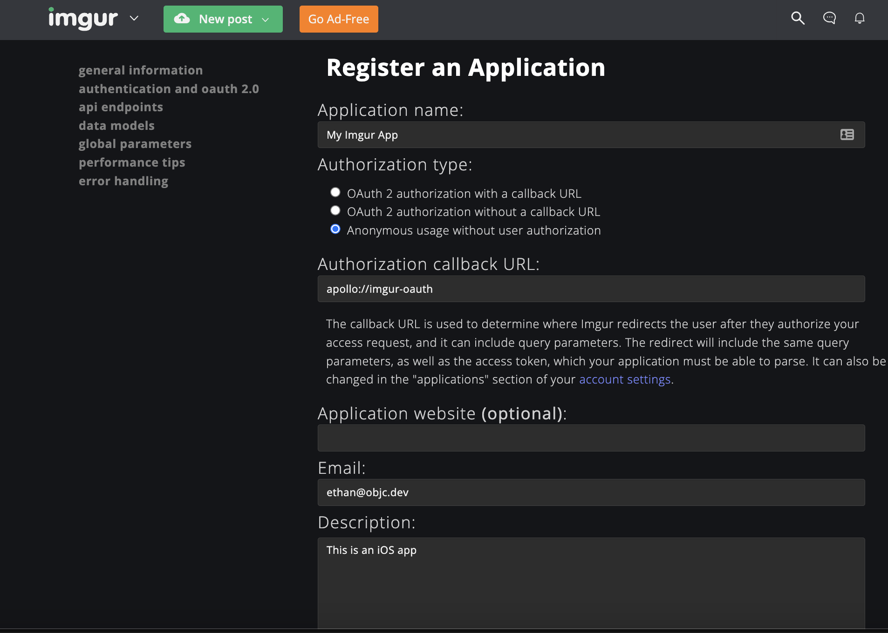

## Use your own reddit and imgur API credentials in Apollo

### Creating Reddit API Credentials

sign out of all accounts in Apollo before installing

1. Install the tweak and launch Apollo.
2. When prompted, sign into reddit.com.
3. After signing in, you'll be redirected to your account's "developer apps" page.
4. A new developer app needs to be created. The tweak will autopopulate all fields with the correct information.
5. Complete the Captcha and click `create app`.
6. Once the app has been created, you will land on the Apollo Home feed.

### Creating Imgur API Credentials

1. Navigate to https://api.imgur.com/oauth2/addclient. Sign in (or create an account)
2. Application name: `anything`
3. Authorization type: `Anonymous usage without user authorization`
4. Authorization callback URL: `apollo://imgur-oauth`
5. Description: `anything`
6. After creating the app, copy the generated `client_id` value into `kImgurClientID` (near the top of the `Tweak.m` file)

